hw2
================
jiyeon
September 12, 2016

3.2.1 Exercises
---------------

1.  As you can see in the below, the ggplot gives the empty plot. This is because the "mpg" data include more than two varibles.

``` r
library(ggplot2)
library(tibble)
ggplot(data = mpg)
```


1.  According to the help, drv variable has three categories. 'f' means front-wheel drive, 'r' means rear wheel drive, and '4' means 4wd.

2.  

``` r
plot(mpg$hwy, mpg$cyl)
```


1.  This command does not work, giving an error. This is because x and y variables are non-numeric variables.

3.3.1 Exercises
---------------

1.  The following command gives the blue points. Since the 'aes' command generates how variables in the data are mapped to visual 'properties' of geoms, the color command in aes should be the function of x or y. But we just need to draw blue points here. So we should move out the color command from aes command.

``` r
ggplot(data = mpg) + 
  geom_point(mapping = aes(x = displ, y = hwy), color = "blue")
```

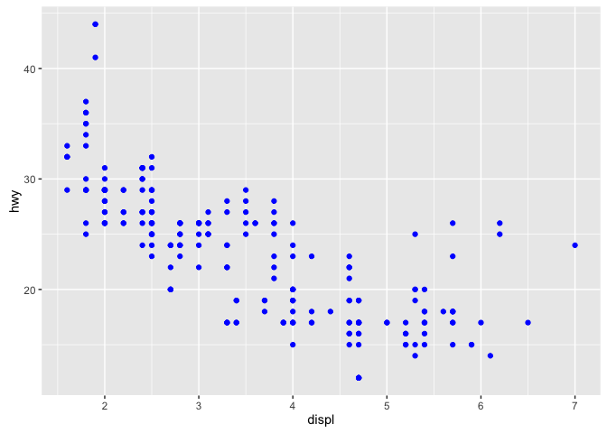

1.  categorical: manufacturer, model, trans, drv, fl, class continuous: displ discrete: year, cyl, cty, hwy If you run the data, the head of the data shows the types of variables; <chr>, <dbl>, <int> <chr> (character) is a categorical variable, <dbl> (double precision) is a continuous variable, and <int> (integer) is a discrete variables.

2.  

``` r
ggplot(data=mpg)+geom_point(mapping=aes(x=cty, y=hwy, color=displ))
```

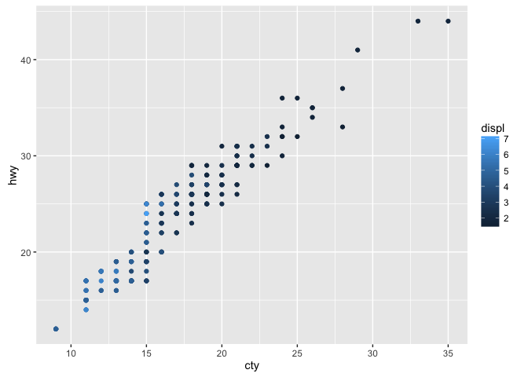

``` r
ggplot(data=mpg)+geom_point(mapping=aes(x=cty, y=hwy, color=drv))
```

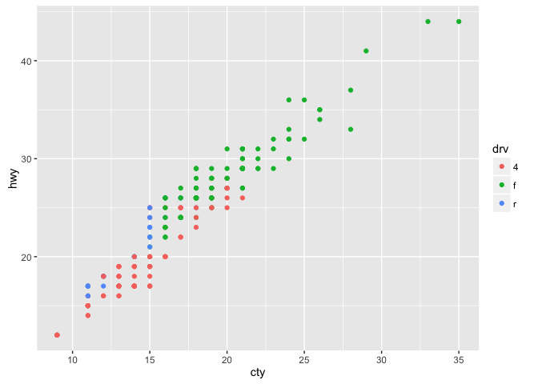

``` r
ggplot(data=mpg)+geom_point(mapping=aes(x=cty, y=hwy, size=displ))
```

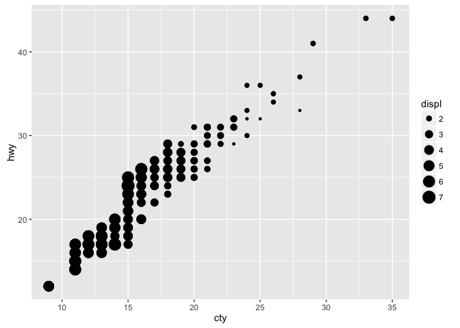

``` r
ggplot(data=mpg)+geom_point(mapping=aes(x=cty, y=hwy, size=drv))
```

    ## Warning: Using size for a discrete variable is not advised.

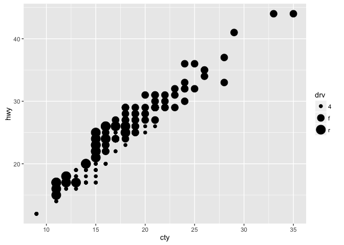

``` r
ggplot(data=mpg)+geom_point(mapping=aes(x=cty, y=hwy, shape=factor(as.integer(displ))))+scale_shape_manual(values=c(1:7))
```


``` r
ggplot(data=mpg)+geom_point(mapping=aes(x=cty, y=hwy, shape=drv))
```

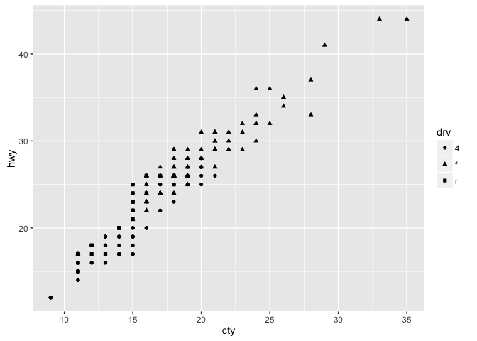

1.  

``` r
ggplot(data=mpg)+geom_point(mapping=aes(x=cty, y=hwy, color=drv, shape=drv))
```

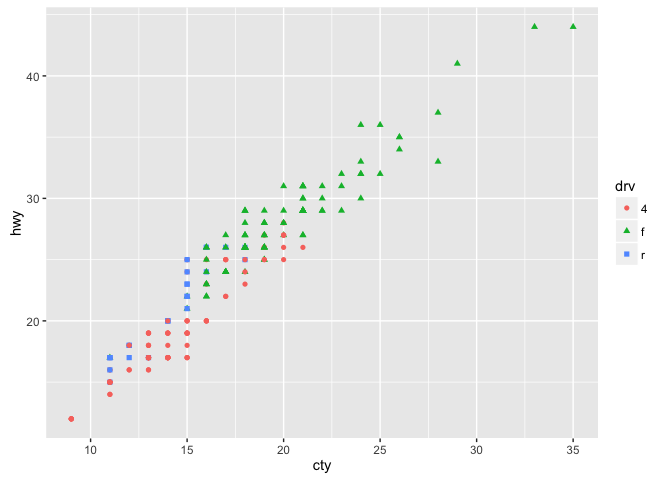

``` r
ggplot(data=mpg)+geom_point(mapping=aes(x=cty, y=hwy, color=fl, shape=drv))
```

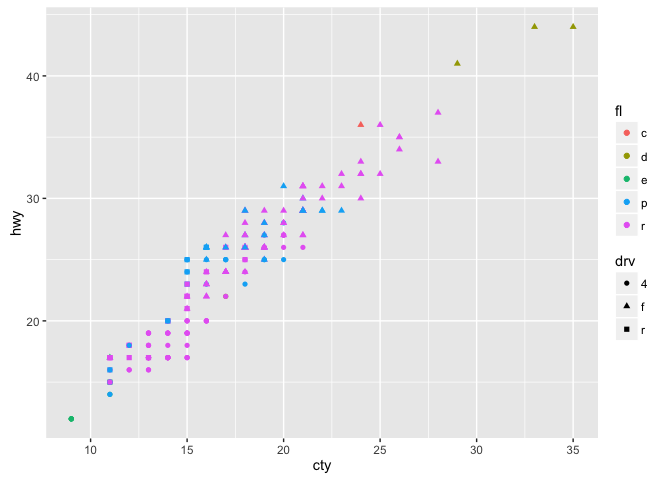

1.  

``` r
ggplot(data=mpg)+geom_point(mapping=aes(x=cty, y=hwy, color=displ), shape=21, stroke=2)
```

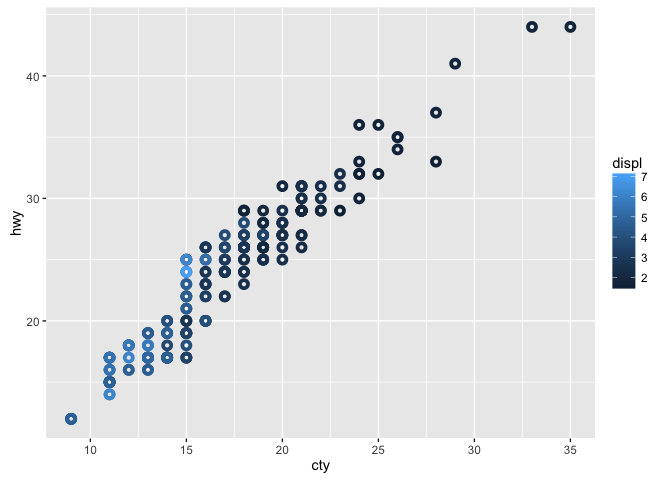

1.  

``` r
ggplot(data=mpg)+geom_point(mapping=aes(x=cty, y = hwy, shape=displ<5))
```

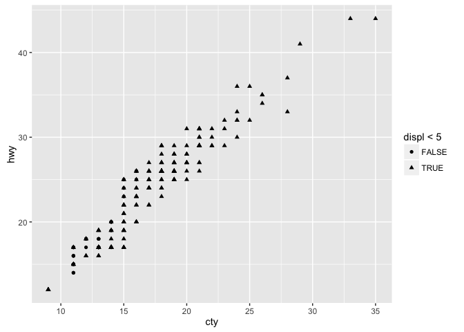

3.5.1 Exercises
---------------

1.  

``` r
ggplot(data = mpg)+geom_point(mapping=aes(x=cty, y=hwy))+facet_wrap(~displ)
```

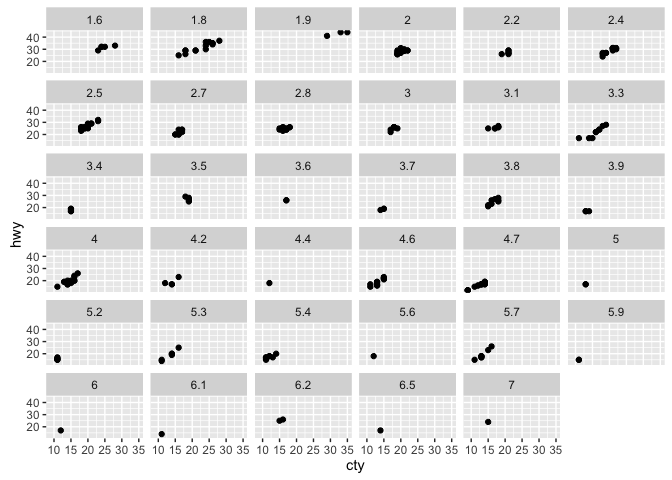

1.  

``` r
ggplot(data = mpg)+geom_point(mapping=aes(x=cty, y=hwy))+facet_grid(drv~cyl)
```

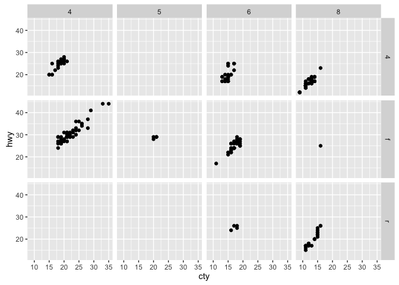

1.  

``` r
ggplot(data = mpg) + 
  geom_point(mapping = aes(x = displ, y = hwy)) +
  facet_grid(drv ~ .)
```

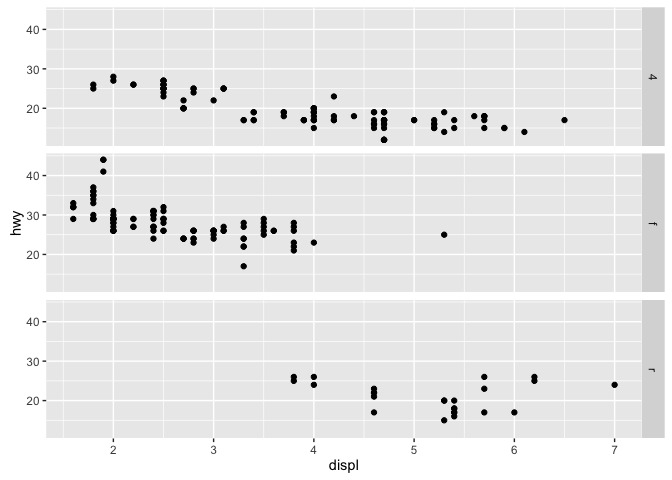

``` r
ggplot(data = mpg) + 
  geom_point(mapping = aes(x = displ, y = hwy)) +
  facet_grid(. ~ cyl)
```

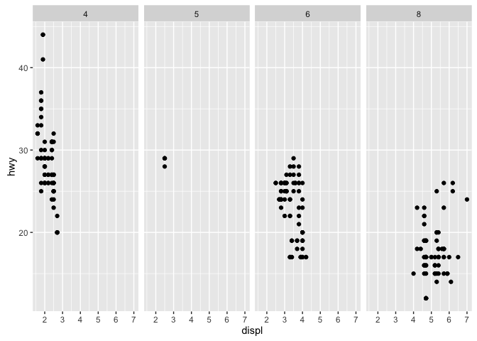

1.  

``` r
ggplot(data = mpg) + 
  geom_point(mapping = aes(x = displ, y = hwy)) + 
  facet_wrap(~ class, nrow = 2)
```

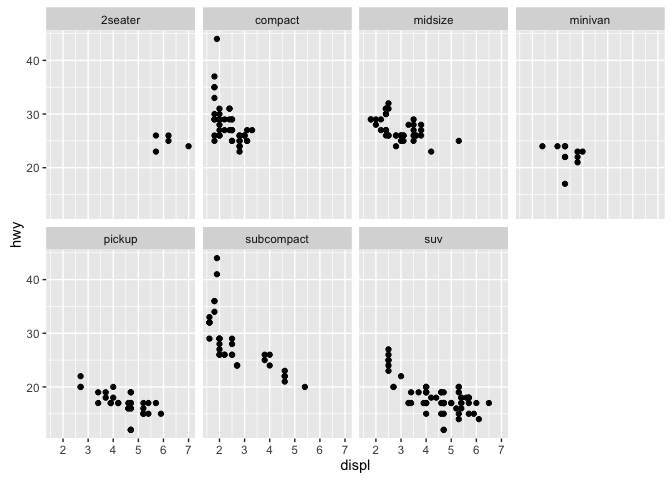

1.  2.  

3.6.1 Exercises
---------------

1.  geom\_line geom\_box geom\_histogram geom\_area

2.  

``` r
ggplot(data = mpg, mapping = aes(x = displ, y = hwy, color = drv)) + 
  geom_point() + 
  geom_smooth(se = FALSE)
```

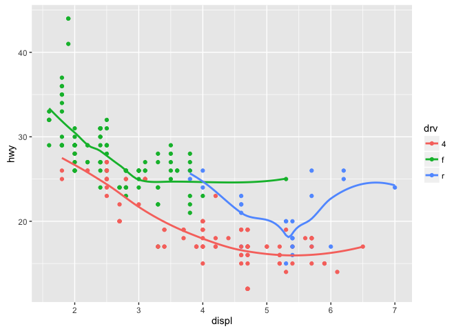

1.  2.  3.  

``` r
ggplot(data = mpg, mapping = aes(x = displ, y = hwy)) + 
  geom_point() + 
  geom_smooth()
```

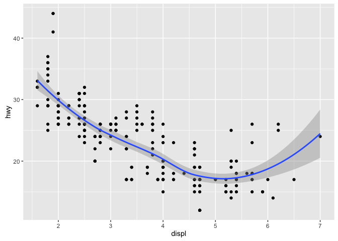

``` r
ggplot() + 
  geom_point(data = mpg, mapping = aes(x = displ, y = hwy)) + 
  geom_smooth(data = mpg, mapping = aes(x = displ, y = hwy))
```


1.  

``` r
ggplot(data = mpg, mapping = aes(x = displ, y = hwy)) + 
  geom_point() + 
  geom_smooth(aes(group = drv), se = FALSE)
```

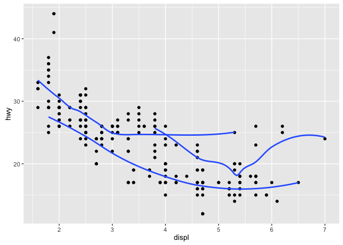

``` r
ggplot(data = mpg, mapping = aes(x = displ, y = hwy)) + 
  geom_smooth(aes(group = drv), se = FALSE) +
  geom_point()
```

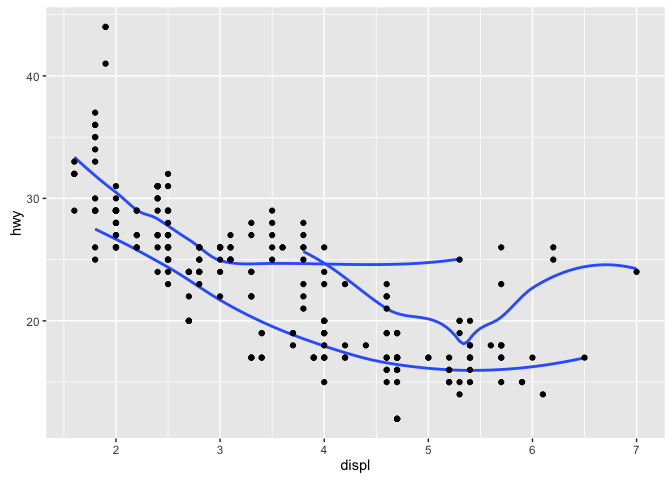

``` r
ggplot(data = mpg, mapping = aes(x = displ, y = hwy, color = drv)) + 
  geom_point() + 
  geom_smooth(se = FALSE)
```


``` r
ggplot(data = mpg, mapping = aes(x = displ, y = hwy)) + 
  geom_point(aes(color = drv)) + 
  geom_smooth(se = FALSE)
```

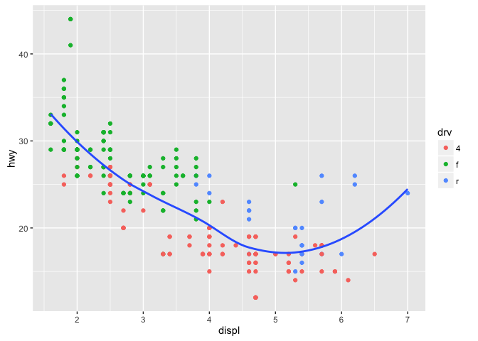

``` r
ggplot(data = mpg, mapping = aes(x = displ, y = hwy)) + 
  geom_point(aes(color = drv)) +
  geom_smooth(aes(linetype = drv), se = FALSE)
```

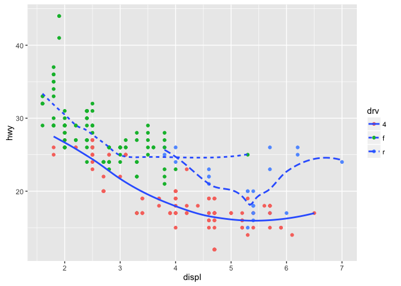

``` r
ggplot(data = mpg, mapping = aes(x = displ, y = hwy)) + 
  geom_point(size = 4, colour = "white") + 
  geom_point(aes(colour = drv))
```

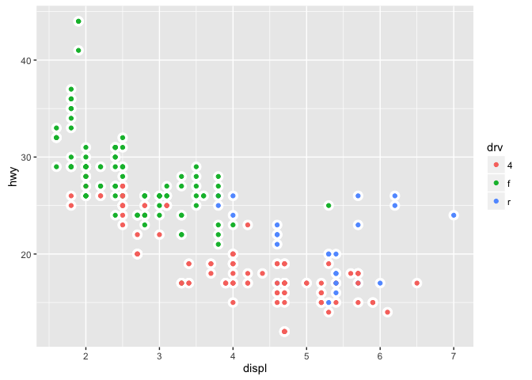

3.7.1 Exercises
---------------

``` r
ggplot(data = diamonds) + 
  geom_bar(mapping = aes(x = cut, y = ..prop..))
```

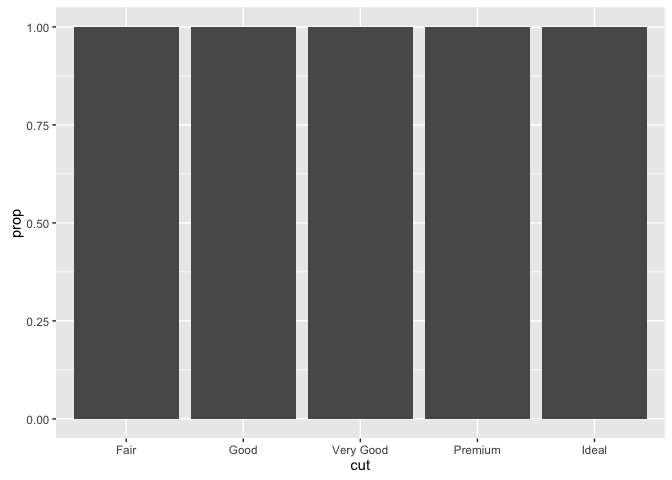
